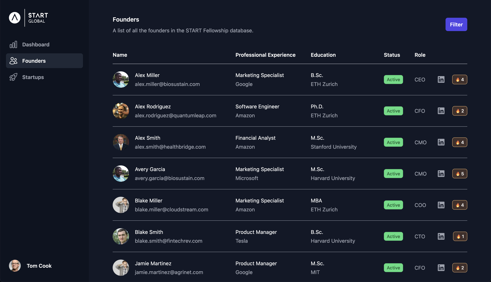

# IncuTrack: Incubator & Accelerator Alumni Network



## Introduction

Welcome to the GitHub repository of IncuTrack, an innovative application designed to revolutionize the way incubators and accelerators manage and engage with their alumni. At the heart of IncuTrack is the goal to foster a thriving community by maintaining strong connections with former students, tracking their progress, and facilitating founder interactions. Whether you're an incubator looking to streamline alumni relations or a founder seeking to connect with peers, IncuTrack provides the tools you need to cultivate a vibrant, supportive network.

## Features

- **Alumni Tracking:** Easily monitor the growth and achievements of your program's graduates.
- **Community Engagement:** Promote interaction and collaboration among founders within the community.
- **Progress Reporting:** Access comprehensive reports on the milestones and successes of alumni ventures.
- **Networking Opportunities:** Leverage the network for mentorship, partnerships, and more.

## Getting Started

IncuTrack is comprised of a Vue.js-powered frontend and a Python FastAPI backend, utilizing MySQL for data persistence. Below are the steps to set up both the frontend and backend environments on your local machine.

### Prerequisites

- Docker Engine
- Node.js and npm
- Python 3 and pip
- Virtualenv (recommended for Python environment management)

### Frontend Setup

1. Navigate to the `frontend` directory.
2. Install dependencies with npm:
    ```
    npm install
    ```
3. Start the development server:
    ```
    npm run dev
    ```
4. Access the frontend at: http://localhost:5173

### Backend Setup

1. Ensure Docker Engine is running on your machine.
2. In the main project directory, start the MySQL database:
    ```
    make start
    ```
   To stop the database, run:
    ```
    make stop
    ```
3. Set up a Python virtual environment (optional but recommended):
    ```
    virtualenv venv
    source venv/bin/activate  # On Windows use `venv\Scripts\activate`
    ```
4. Install required Python packages:
    ```
    pip install -r requirements.txt
    ```
5. Start the REST API server using uvicorn:
    ```
    uvicorn main:app --reload
    ```
6. Access the REST API documentation (playground) at: http://localhost:8000/docs
